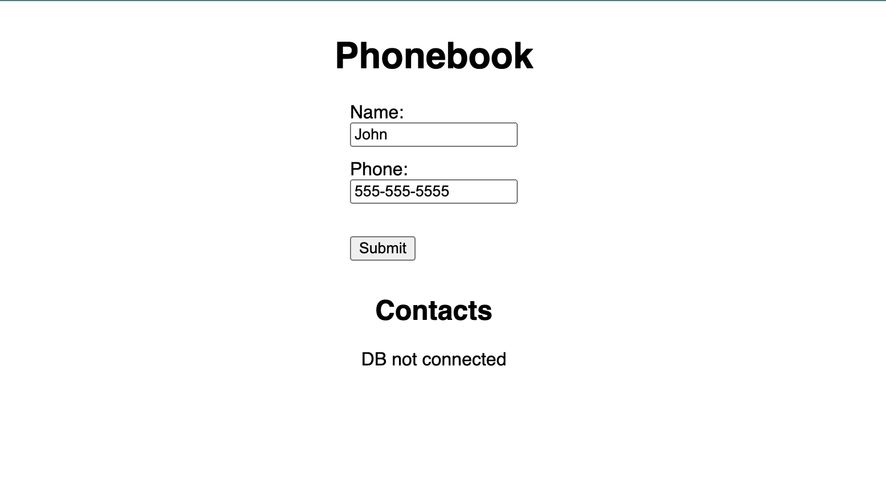

# Personal Cloud Docker Lab

## Prerequisites:
- Docker daemon running on your platform (Docker Desktop, Orbstack, etc.)
- Text Editor/IDE
- Terminal (Examples will be ZSH but should be translatable to shell of your choice)

## Overview:
In this lab we will use Docker Compose to deploy a simple phonebook buitl with Express.js. It uses a MySQL database for storing contacts and a (totally unnecessary) Redis database for caching.

The source code for the app can be found in the `./app` directory. A Dockerfile for the app is already provided for you.

- Build the image by running `docker build -t hello_compose:latest ./app`. This will create a new image called `hello_compose:latest` from the Dockerfile in the `./app` directory
- Run `docker images` to verify that the image was created
- Run `docker run -it hello_compose:latest` to start the container
- You should see the following message in the terminal:
> REDIS_URL not set, skipping Redis connection
<br>
> DB_URL not set, skipping DB connection
<br>
> Example app listening on port 3000!

What happens when you try to access the app in your browser at `localhost:3000`?

## Task 1: Create a docker-compose.yml file

Our app started, and it said it was listening on port 3000. So, why can't we access it in our browser? The answer is that we didn't map the port to our host. One way to do this would be to pass another argument to `docker run`; however, we can also do this in our `docker-compose.yml` file with the `ports` directive.

- Create a new file called `docker-compose.yml` in the root of the project
- Add the following to the file:
```yaml
version: "3.8"
services:
  app:
    image: hello_compose:latest
    ports:
      # Assign the container's port 3000 to any open port on the host
      # To use a specific port, use the format: "<host_port>:<container_port>"
      - "3000"
```
- Run `docker-compose up` to start the container. You should see the following output:
```bash
[+] Running 2/0
 ✔ Container docker-hacknight-app-1  Created          0.0s 
Attaching to app-1
app-1  | 
app-1  | > app@1.0.0 start
app-1  | > node index.js
app-1  | 
app-1  | REDIS_URL not set, skipping Redis connection
app-1  | DB_URL not set, skipping DB connection
app-1  | Example app listening on port 3000!
```

Why was the output different this time? Can you access the app in your browser at `localhost:3000`?

## Task 2: Access the app in your browser

Now that we have the app running, let's try to access it in our browser. We know that the app is listening on port 3000, but we don't know which port on our host it's mapped to. We can use the `docker-compose ps` command to find out.

- Open a new terminal window and navigate to the root of the project, where the `docker-compose.yml` file is located.
- Run `docker-compose ps` to see the status of our containers. You should see something like this:
```bash
NAME                    IMAGE                COMMAND                SERVICE CREATED        STATUS        PORTS
---------------------------------------------------------------------------------------------------------------------------------
docker-hacknight-app-1  hello_compose:latest "/bin/sh -c 'npm sta…" app     14 minutes ago Up 14 minutes 0.0.0.0:53232->3000/tcp
```
- Take note of the `PORTS` column. It tells us that port 3000 in the container is mapped to `0.0.0.0:53232` on our host. 0.0.0.0 is localhost, so we should be able to access the app in our browser at `localhost:53232`!
- Now that we know the app is running, and we know which port it's mapped to, we can access it in our browser. Go to `localhost:51282` in your browser. If everything worked, you should see the following app:


What do you see in the terminal where you ran `docker-compose up`? What happens if you refresh the page in your browser? What happens if you try to add a new contact?

## Task 3: Add a database

Now that we have our app running, let's add a database. We'll use MariaDB, which is a fork of MySQL. But what happens if our app happens to connect to the database container before it finishes starting up? We can use the `depends_on` directive to tell Docker Compose to wait for the database container to start before starting the app container.

- Stop the currently running stack by pressing `Ctrl+C` in the terminal where you ran `docker-compose up`.
- Add a new service to the `docker-compose.yml` file:
```yaml
version: "3.8"
services:
  app:
    image: hello_compose:latest
    ports:
      # Assign the container's port 3000 to any open port on the host
      # To use a specific port, use the format: "<host_port>:<container_port>"
      - "3000"
    depends_on:
      - db
  db:
    image: mariadb:latest
```

- Run `docker-compose down` to safely stop the currently running containers.
- Run `docker-compose up` to start the containers again from our updated compose file. You should see something like this:
```bash
[+] Running 3/3
 ✔ Network docker-hacknight_default  Created         0.0s 
 ✔ Container docker-hacknight-db-1   Created         0.1s 
 ✔ Container docker-hacknight-app-1  Created         0.0s 
Attaching to app-1, db-1
db-1   | 2024-01-23 21:39:41+00:00 [Note] [Entrypoint]: Entrypoint script for MariaDB Server 1:11.2.2+maria~ubu2204 started.
db-1   | 2024-01-23 21:39:41+00:00 [Note] [Entrypoint]: Switching to dedicated user 'mysql'
db-1   | 2024-01-23 21:39:41+00:00 [Note] [Entrypoint]: Entrypoint script for MariaDB Server 1:11.2.2+maria~ubu2204 started.
db-1   | 2024-01-23 21:39:41+00:00 [ERROR] [Entrypoint]: Database is uninitialized and password option is not specified
db-1   |        You need to specify one of MARIADB_ROOT_PASSWORD, MARIADB_ROOT_PASSWORD_HASH, MARIADB_ALLOW_EMPTY_ROOT_PASSWORD and MARIADB_RANDOM_ROOT_PASSWORD
app-1  | 
app-1  | > app@1.0.0 start
app-1  | > node index.js
app-1  | 
db-1 exited with code 1
app-1  | REDIS_URL not set, skipping Redis connection
app-1  | DB_URL not set, skipping DB connection
app-1  | Example app listening on port 3000!
```

- Run `docker-compose ps` to verify that that both containers are running, and once again get the port number for the app container.

What happened? Why did our database container exit with an error? Why does our app container still say `DB_URL` not set? When we started the containers, we saw an extra line in the output: `Network docker-hacknight_default Created`. Why did this happen?

## Connecting to the database

Looks like MariaDB failed because it didn't find an environment variable called `MARIADB_ROOT_PASSWORD`. That explains why the database failed. If we look at line 6 of the `index.js` file, we can see why our app failed to connect to the database. It's looking for an environment variable called `DB_URL` on `process.env`, but it's not finding it.

We know that the connection string should look like `mariadb://<user>:<password>@<host>[:<port>?]/<database>`.

The default user is `root`, and we can leave out a port number since we only have 1 service per container. As we saw in the logs, the root password is set using the `MARIADB_ROOT_PASSWORD` environment variable. We can similarly use `MARIADB_DATABASE` to set the name of the database. 

But how do we know the hostname of the database container, and how do we set the environment variables for our containers before they start?

To answer the first question, we need to understand how Docker Compose creates networks. Remember when we ran `docker-compose up` and saw the line `Network docker-hacknight_default Created`? 

Because we have two services in our compose file, Docker was kind enough to automatically create a private network for them to communicate on. The name of the network is `<project_name>_default`, where `<project_name>` is the name of the directory that contains the `docker-compose.yml` file. In our case, the network is called `docker-hacknight_default`.

When Docker creates a network, it also creates a DNS server for that network that allows containers to communicate with each other using just the service name! In our case, we have two services: `app` and `db`. So, we can use the hostname `db` to connect to our database container from our app container.

This gives us the following values for our environment variables:
```yaml
- db
 - MARIADB_ROOT_PASSWORD: my-secret-pw (or whatever you want)
 - MARIADB_DATABASE: phonebook

- app
 - DB_URL: mariadb://root:my-secret-pw@db/phonebook
```

- Add the following to the `docker-compose.yml` file:
```yaml
version: "3.8"
services:
  app:
    image: hello_compose:latest
    ports:
      # Assign the container's port 3000 to any open port on the host
      # To use a specific port, use the format: "<host_port>:<container_port>"
      - "3000"
    depends_on:
      - db
    environment:
      - DB_URL=mariadb://root:my-secret-pw@db/phonebook
  db:
    image: mariadb:latest
    environment:
      - MARIADB_ROOT_PASSWORD=my-secret-pw
      - MARIADB_DATABASE=phonebook
```
- Take note of the output in the terminal where you ran `docker-compose up`.
- Try to add some contacts in the app.
- Click on one of the contacts you added.
- Go back to the home page and refresh the page.

What happened? Did the contacts persist? How long did it take to load when you clicked on a contact?

## Task 4: Add a Redis cache

Great, our app works! But, wow... it takes forever to load a contact! It must be a popular app, because apparently it's getting a lot of traffic. We should add a cache to speed things up. Remember to make sure the cache container is running before the app container starts!

- Stop the currently running stack by pressing `Ctrl+C` in the terminal where you ran `docker-compose up`.
- Take a look again at `index.js`. Lucky for us! It looks like the app is already prepared to use a Redis cache if one is available. We just need to set the `REDIS_URL` environment variable.
- Add a new service to the `docker-compose.yml`, and set the `REDIS_URL` environment variable for the app:
```yaml
version: "3.8"
services:
  app:
    image: hello_compose:latest
    ports:
      # Assign the container's port 3000 to any open port on the host
      # To use a specific port, use the format: "<host_port>:<container_port>"
      - "3000"
    depends_on:
      - db
      - cache
    environment:
      - DB_URL=mariadb://root:my-secret-pw@db/phonebook
      - REDIS_URL=redis://cache
  db:
    image: mariadb:latest
    environment:
      - MARIADB_ROOT_PASSWORD=my-secret-pw
      - MARIADB_DATABASE=phonebook
  cache:
    image: redis:latest
```

- Run `docker-compose up` to start the containers again from our updated compose file.
- In a new terminal window, run `docker-compose ps` to verify that that all three containers are running, and once again get the port number for the app container.
- Navigate to `localhost:<app_port>` in your browser, and try to add a contact.
- Click on one of the contacts you added.
- Go back to the home page and click on the same contact again.
- Stop the currently running stack by pressing `Ctrl+C` in the terminal where you ran `docker-compose up`.
- Restart the stack by running `docker-compose up` again.

What happened? How long did it take to load when you clicked on a contact? How long did it take to load when you clicked on the same contact again?

## Task 5: Persist data

Great! Our app is working, and it's fast! But wait... we just restarted the stack. That blew away all of our containers... so how did our contacts persist?

It turns out that the MariaDB image specifies a volume in its Dockerfile, and mounts it to `/var/lib/mysql`. This means that the data in the database is stored in a volume, and not in the container. When we restarted the stack, the container was over-written, but the volume persisted. When we started the stack again, a new container was created, and the volume was mounted to the new container.

We can verify this by running `docker volume ls`. You should see something like this:
```bash
DRIVER    VOLUME NAME
local     0c147a5243a65d99241c6f93025a5c53eaa55905696d0d37ec9df92214c18b3a
```

That's a terrible name! We don't want to type that. Also, what if we have many volumes? We'd never be able to tell them apart. We can use the `volumes` directive to give our volume a name.

- Stop the currently running stack by pressing `Ctrl+C` in the terminal where you ran `docker-compose up`.
- Add a `volumes` directive to the `docker-compose.yml` file and configure the `db` service to use it:
```yaml
version: "3.8"
services:
  app:
    image: hello_compose:latest
    ports:
      # Assign the container's port 3000 to any open port on the host
      # To use a specific port, use the format: "<host_port>:<container_port>"
      - "3000"
    depends_on:
      - db
      - cache
    environment:
      - DB_URL=mariadb://root:my-secret-pw@db/phonebook
      - REDIS_URL=redis://cache
  db:
    image: mariadb:latest
    environment:
      - MARIADB_ROOT_PASSWORD=my-secret-pw
      - MARIADB_DATABASE=phonebook
    volumes:
      - phonebook_data:/var/lib/mysql
  cache:
    image: redis:latest
    
volumes:
  phonebook_data:
```

- Run `docker-compose up` to start the containers again from our updated compose file.
- In a new terminal window, run `docker-compose ps` to verify that that all three containers are running, and once again get the port number for the app container.
- Navigate to `localhost:<app_port>` in your browser, and try to add a contact.
- Destroy the stack by running `docker-compose down`
- Run `docker volume ls` to verify that the volume still exists.

NICE!

## BONUSES:

### Bonus 1: Make it more secure

You might have noticed that we logged in to the database using the `root` user. This is a bad idea. We should create a new, non-admin user to access the database. Check the docs for the [MariaDB image](https://hub.docker.com/_/mariadb) if you need a hint!


### Bonus 2: Persist the data in a local directory on your host, instead of a volume

Sometimes you want your data to persist on the local file system instead of in a volume. This is especially useful if you want to be able to access the data outside of Docker.
